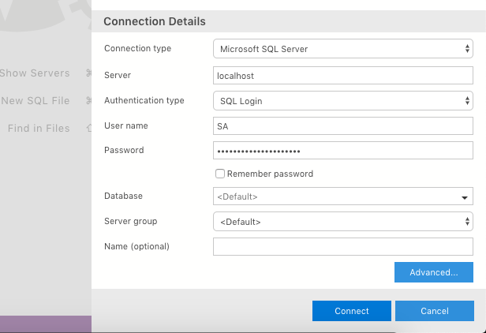

# Microsoft SQL Server Dockerized e Azure Data Studio

Através deste repo estou buscando fazer com que você tenha uma instalação rápida e fácil
para estar utilizando o SQL Server e o Azure Data Studio para estudos de disciplinas de banco de dados,
que não envolvam tarefas e ambientes complexos. Logo, vou ser bem direto para que você tenha um servidor
SQL Server e uma ferramenta de gerenciamento para trabalhar com o SGBD no Mac ou Linux.
Tudo aqui foi pesquisado e desenvolvido seguindo as documentações.

Para ter o Microsoft SQL Server em um ambiente Mac ou Linux você precisa ter
o Docker instalado na sua máquina, acesse [https://docs.docker.com/install/](https://docs.docker.com/install/)
para obter o Docker Community Edition (CE).

Se você deseja baixar a imagem do SQL Server de forma interativa, execute o script
`pullimage.sh` (clone ou baixe este repo em sua máquina e esteja dentro do diretório):

```bash
~ bash pullimage.sh
```


Caso queira baixar diretamente a imagem, utilize o seguinte comando:

```bash
~ sudo docker pull mcr.microsoft.com/mssql/server:<ATagQueDesejar>
```

Para obter uma lista de todas as tags disponíveis para o Microsoft SQL Server, clique [aqui](https://hub.docker.com/_/microsoft-mssql-server).

Depois de baixada a imagem, execute o seguinte comando:

><YourStrong!Passw0rd>: substitua isto pela senha que deseja para o seu
SGBD. **Atenção: Sua senha deve ter pelo menos 8 caracteres e conter entre letras maiusculas, letras minúsculas, dígitos de base decimal e símbolos.**
Lembrando que você deve utilizar a tag correspondente baixada, no exemplo abaixo
consideramos que você baixou a imagem do SQL Server com a tag *2017-latest*.

```bash
~ sudo docker run -e 'ACCEPT_EULA=Y' -e 'SA_PASSWORD=<YourStrong!Passw0rd>' \
   -p 1433:1433 --name sqlserver_container \
   -d mcr.microsoft.com/mssql/server:2017-latest
```

Fique à vontade para mudar o valor da flag `--name`. Você também pode mudar o encaminhamento
da porta do host para o contêiner. Temos `<HOST>:<CONTEINER>`, você pode utilizar qualquer outra porta
válida como -p `8000:1433`. Ou também você pode deixar a responsabilidade por alocar as portas para
o Docker com a flag `-P`. Para visualizar que porta foi alocada para o seu contêiner, utilize o
comando: `docker port <NomeDoContainer>`.  

Pronto. Você já tem o SQL Server executando na sua máquina. Com o comando `docker ps` você pode
observar o contêiner de pé. Vamos nos conectar nele. Utilize o seguinte comando:

```bash
~ sudo docker exec -it sqlserver_container "bash"
```

Dentro do contêiner nós vamos utilizar o `sqlcmd`, ele não
está no path então especifique o caminho completo:

```bash
/opt/mssql-tools/bin/sqlcmd -S localhost -U SA -P '<ASenhaQueVocecriou19@qui>'
```


Esse modo não fica talvez tão interessante para se trabalhar. Então vamos utilizar o Azure Data Studio para melhorar isso. Para sair do contêiner utilize o comando `exit` para sair do SGBD, depois mais um `exit` para sair do contêiner.

O Azure Data Studio de cara se parece
muito com o [SQL Server Management Studio](https://docs.microsoft.com/pt-br/sql/ssms/sql-server-management-studio-ssms?view=sql-server-2017), porém em contrapartida o Azure Data Studio funciona tanto no Windows, quanto no Mac e Linux, o que não acontece com o *SSMS*. Para saber mais acesse [O que é o Azure Data Studio?](https://docs.microsoft.com/pt-br/sql/azure-data-studio/what-is?view=sql-server-2017)

Baixe e instale o Azure Data Studio seguindo a documentação clicando [aqui](https://docs.microsoft.com/pt-br/sql/azure-data-studio/download?view=sql-server-2017)

Pronto, agora que já tem o Azure Data Studio instalado, realize uma conexão com a instância do SQL Server que criamos através do nosso contêiner.
Ao abrir ele você encontrará uma área como esta:


Complete os respectivos campos com os seguintes valores:

+ Server: **localhost**. *Se você utilizou outra porta diferente de 1433 para o host, coloque uma virgula
depois de localhost e o número da porta alocada. Por exemplo: `localhost,8000`*
+ User name: **SA**
+ Password: **ASenhaQueVocecriou19@qui**



Agora clique em `Connect` e aparecerá uma tela como esta:


Como pode observar, o banco de dados criado na linha de comando está aparecendo:


Podemos realizar uma nova query:


Então podemos ficar à vontade para realizar outras queries:


Whoala! Pronto, agora você tem todo um ambiente para estar utilizando o SQL Server de maneira confortável. Recomendo explorar o Azure Data Studio.

Caso não queira mais o contêiner,
utilize o comando para parar o contêiner:

```bash
~ sudo docker stop sqlserver_container
```

Quando quiser o contêiner de pé de novo,
utilize o comando:

```bash
~ sudo docker start sqlserver_container
```

Os bancos de dados criados serão recuperados :), fique tranquilo.

E para remover o contêiner utilize o seguinte comando:

>**Atenção: se remover o contêiner, você precisará refazer todo o processo de configuração do começo e
seus bancos de dados serão perdidos.**

```bash
~ sudo docker rm -v <ONomeDoSeuContainer>
````
